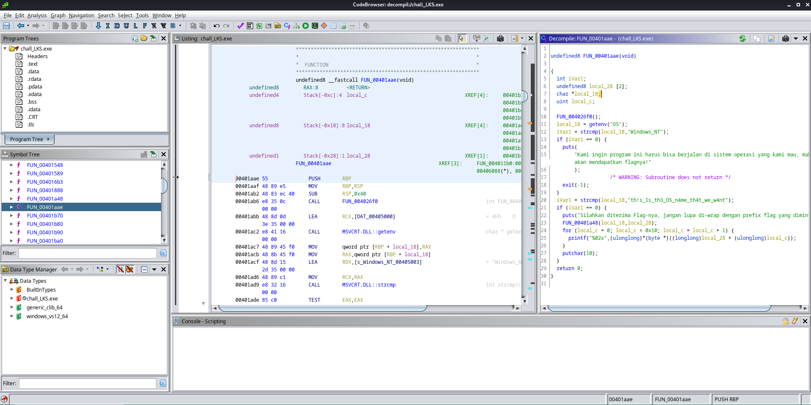
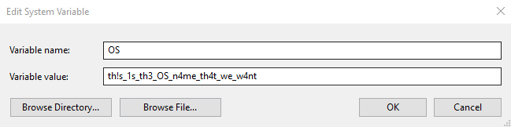
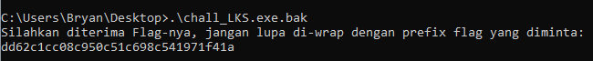

# Solve

## Decompile the exe

Coba dilihat pada bagian dekompilasi, disana ada fungsi getenv yang akan membaca variable dari OS.

lalu ada fungsi strcmp yg berfungsi untuk melakukan komparasi string, if OS=="Windows_NT" then error_message. 

if OS=="th!s_1s_th3_OS_n4me_th4t_we_w4nt" then print flag.

## Set OS env variable

## Run the binary :)

### Hore solved!!