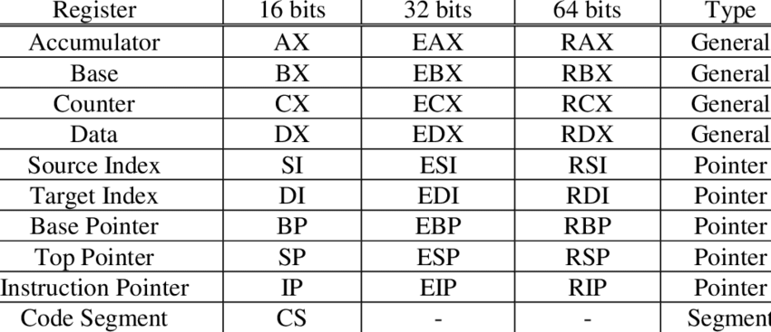

# Reverse Engineering (https://ctf101.org/reverse-engineering)

## Assembly

Source Code


```
#include <stdio.h>

int main(){
    int a = 10;
    int b = 20;

    printf("Hello World");
    return 0;
}
```


Assembly

```
.LC0:
        .string "Hello World"
main:
        push    rbp
        mov     rbp, rsp
        sub     rsp, 16
        mov     DWORD PTR [rbp-4], 10
        mov     DWORD PTR [rbp-8], 20
        mov     edi, OFFSET FLAT:.LC0
        mov     eax, 0
        call    printf
        mov     eax, 0
        leave
        ret
```

## Register



Perbedaan hanya ada di awal register, sisanya mirip sama..


1. ### Instruction

- Data movement: mov rax, [rsp - 0x02]
- Arithmetic: add rax, rbx
- Control-flow: jne 0x8000300


2. ### Execution

```
RIP --->    0x0804000: mov eax, 0x10                  Register Values:
            0x0804005: mov ebx, 0x2                   RIP = 0x0804000
            0x080400a: add, rax, rbx                  RAX = 0x0
            0x080400d: inc rbx                        RBX = 0x0
            0x0804010: sub rax, rbx                   RCX = 0x0
            0x0804013: mov rcx, rax                   RDX = 0x0
```

```
            0x0804000: mov eax, 0x10                  Register Values:
RIP --->    0x0804005: mov ebx, 0x2                   RIP = 0x0804005
            0x080400a: add, rax, rbx                  RAX = 0x10
            0x080400d: inc rbx                        RBX = 0x0
            0x0804010: sub rax, rbx                   RCX = 0x0
            0x0804013: mov rcx, rax                   RDX = 0x0
```

```
            0x0804000: mov eax, 0x10                  Register Values:
            0x0804005: mov ebx, 0x2                   RIP = 0x080400a
RIP --->    0x080400a: add, rax, rbx                  RAX = 0x10
            0x080400d: inc rbx                        RBX = 0x2
            0x0804010: sub rax, rbx                   RCX = 0x0
            0x0804013: mov rcx, rax                   RDX = 0x0
```

```
            0x0804000: mov eax, 0x10                  Register Values:
            0x0804005: mov ebx, 0x2                   RIP = 0x080400d
            0x080400a: add, rax, rbx                  RAX = 0x12
RIP --->    0x080400d: inc rbx                        RBX = 0x2
            0x0804010: sub rax, rbx                   RCX = 0x0
            0x0804013: mov rcx, rax                   RDX = 0x0
```


```
            0x0804000: mov eax, 0x10                  Register Values:
            0x0804005: mov ebx, 0x2                   RIP = 0x0804010
            0x080400a: add, rax, rbx                  RAX = 0x12
            0x080400d: inc rbx                        RBX = 0x3
RIP --->    0x0804010: sub rax, rbx                   RCX = 0x0
            0x0804013: mov rcx, rax                   RDX = 0x0
```
```
            0x0804000: mov eax, 0x10                  Register Values:
            0x0804005: mov ebx, 0x2                   RIP = 0x0804013
            0x080400a: add, rax, rbx                  RAX = 0x9
            0x080400d: inc rbx                        RBX = 0x3
            0x0804010: sub rax, rbx                   RCX = 0x0
RIP --->    0x0804013: mov rcx, rax                   RDX = 0x0
```

```
            0x0804000: mov eax, 0x10                  Register Values:
            0x0804005: mov ebx, 0x2                   RIP = 0x080400a
            0x080400a: add, rax, rbx                  RAX = 0x9
            0x080400d: inc rbx                        RBX = 0x3
            0x0804010: sub rax, rbx                   RCX = 0x9
            0x0804013: mov rcx, rax                   RDX = 0x0
```

3. ### Control Flow (https://faydoc.tripod.com/cpu)

- jnz (Jump Not Zero)
- jz (Jump equal)
- jge (Jump greater)
- jle (Jump less or equal)
- jl (Jump less)
- ....


4. ### Address 
